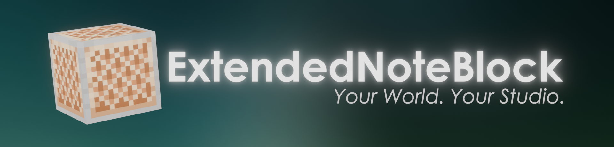

**【本项目不再维护】**
由于本人时间、精力、能力水平的限制，继续维护这个项目不仅难以及时修复问题，而且可能引入更多不确定性。现将此项目归档，您仍然可以 Fork 并自行修改，但将不能再提交 Issue 或 Pull Request，也不会收到任何更新。

**【このプロジェクトはメンテナンス終了】**
私の時間・労力・能力の限界により、このプロジェクトを継続してメンテナンスすることは、問題への迅速な対応が難しくなるだけでなく、新たな不確実性を招く恐れがあります。つきましては、本プロジェクトをアーカイブ（読み取り専用）とします。引き続き Fork してご自身で修正いただくことは可能ですが、Issue や Pull Request の受け付けは終了させていただきます。また、更新を受け取ることもできなくなります。

**【This project is no longer maintained】**
Due to limitations of my time, energy, and skill, continuing to maintain this project would not only make it difficult to address issues promptly, but may also introduce further uncertainty. This project has now been archived. You may still fork it and modify it yourself, but you will no longer be able to submit Issues or Pull Requests, nor will you receive any updates.

# Extended Note Block

**English** | [简体中文](/docs/README_zh-cn.md) | [日本語](/docs/README_ja-jp.md)

**Extended Note Block** is a Fabric mod dedicated to bringing a professional-grade music creation experience to Minecraft.

---

### Key Features
* **Extended Note Blocks**: Support for MIDI pitch (0-127), velocity, sustain, delay, and fade control.
* **Advanced Mode**: Visualized volume and pitch envelope editing, plus mathematical expression-based sound source movement (`x`, `y`, `z`, `t`).
* **Wireless Redstone**: Global range Redstone signal transmission (Transmitter/Receiver).
* **Conductor's Wand**: Supports area selection and batch editing of Note Blocks within the selected region.
* **Smooth Motion**: Smooth movement commands that allow players to glide in a specific direction.

### Installation

1.  Install [Fabric Loader](https://fabricmc.net/) and [Fabric API](https://modrinth.com/mod/fabric-api).
2.  Download **Extended Note Block** and place it in your `mods` folder.
3.  *(Optional)* [Carpet Mod](https://github.com/gnembon/fabric-carpet) is highly recommended.

### How to Use

[Click here to view the detailed User Manual](https://atemukesu.github.io/ExtendedNoteBlock/)

### Screenshots

### Contributing

Contributions of any kind are welcome! You can participate by:

* **Submitting Issues**: Report bugs, suggest new features, or provide feedback.
* **Submitting Pull Requests**: Fix known issues, optimize code, or improve documentation.
* **Localization**: Help us translate the mod into more languages.

See the [Development Guide](/docs/DEVELOPMENT.md) for the multi-version project setup, build instructions, and development workflow.

Please ensure your code follows the project's coding style before submitting a PR.

### License
This project is licensed under the [MIT License](LICENSE).
